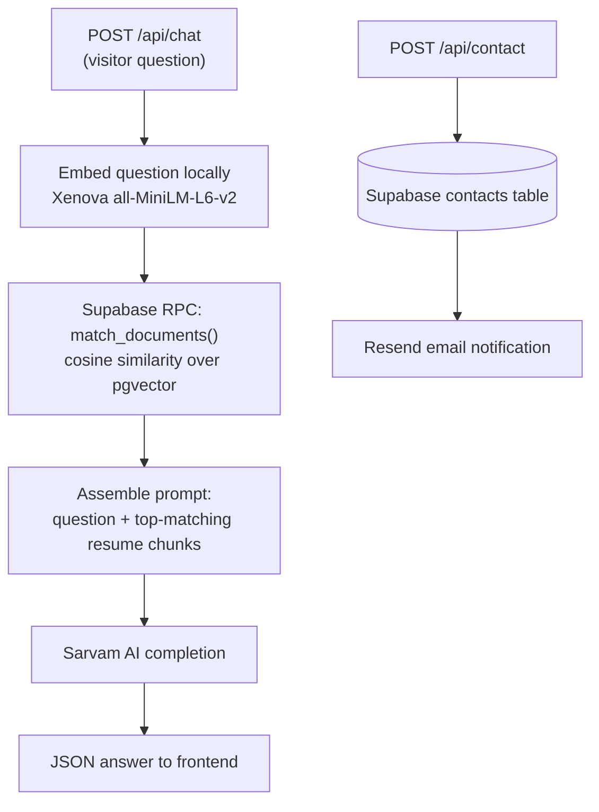
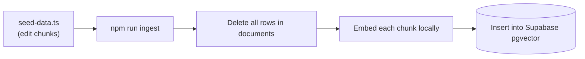

# Portfolio AI Backend (RAG API)

Express + LangChain backend powering the AI chatbot and contact form on [mounikamurugonda.vercel.app](https://mounikamurugonda.vercel.app). The frontend lives in the separate [`portfolio`](https://github.com/mounikamurugonda/portfolio) repository.

## 🧱 Tech Stack

| Concern | Technology |
|---|---|
| Server | Node.js, Express, TypeScript (`tsx` in dev) |
| RAG | LangChain + Supabase pgvector |
| Embeddings | `Xenova/all-MiniLM-L6-v2` (runs locally in-process, 384 dims — no embedding API cost) |
| LLM | Sarvam AI (`sarvam-m`) |
| Email | Resend |
| Hardening | CORS allow-list, express-rate-limit (100 req / 15 min per IP) |

## 🗺️ Request Flow



## 📂 Project Structure

```text
api-portfolio/
├── src/
│   ├── index.ts          # Express app: CORS, rate limiting, routes
│   ├── lib/
│   │   ├── rag.ts        # Vector store + local Xenova embeddings
│   │   ├── sarvam.ts     # Sarvam AI client
│   │   └── supabase.ts   # Supabase client (service role)
│   └── routes/
│       ├── chat.ts       # RAG chat endpoint
│       └── contact.ts    # Contact form endpoint
├── scripts/
│   ├── seed-data.ts      # Resume knowledge base (the single source of truth)
│   └── ingest.ts         # Clears + re-embeds seed data into Supabase
└── .env.example          # Required environment variables
```

## 🛠️ Setup

### 1. Install

```bash
git clone https://github.com/mounikamurugonda/api-portfolio.git
cd api-portfolio
npm install
```

### 2. Environment variables

Copy `.env.example` to `.env` and fill in:

```env
PORT=3000
SARVAM_API_KEY=sk_...            # Sarvam AI dashboard
SUPABASE_URL=https://...         # Supabase → Settings → API
SUPABASE_SERVICE_ROLE_KEY=eyJ... # service_role key (server-side ONLY)
RESEND_API_KEY=re_...            # Resend dashboard
FRONTEND_URL=http://localhost:5173  # CORS origin (production: your Vercel URL)
```

> The service-role key bypasses row-level security. It must never be committed or exposed to the frontend — `.env` is gitignored.

### 3. Database

The SQL schema (contacts table, `documents` pgvector table, and `match_documents()` function) lives in the frontend repo at `supabase/migrations/`. Run it once in the Supabase SQL Editor.

## 🔄 Updating the AI's knowledge (after a resume change)

1. Edit [`scripts/seed-data.ts`](scripts/seed-data.ts) — each array entry is one retrievable chunk. Keep chunks focused (one role, one skill area, or one fact each).
2. Re-ingest:

```bash
npm run ingest
```

The ingest script **deletes all rows** in the `documents` table, then re-embeds and inserts every chunk, so the vector store always mirrors `seed-data.ts` exactly.



## ▶️ Run

```bash
npm run dev      # tsx watch, http://localhost:3000
npm run build    # tsc → dist/
npm start        # node dist/index.js
```

Endpoints:

- `POST /api/chat` — `{ "message": "..." }` → RAG-grounded answer
- `POST /api/contact` — `{ "name", "email", "message" }` → saved + emailed
- `GET /health` — liveness check

## 🚀 Deployment

Deployed to Vercel (serverless). Set all `.env` values in the project's environment settings and point the frontend's `VITE_API_URL` at the deployed URL. Note: cold starts must download the embedding model; `rag.ts` guards this with a 5-second timeout and the chat route falls back to a static context if it trips.

---
Built with ❤️ by Mounika Murugonda
